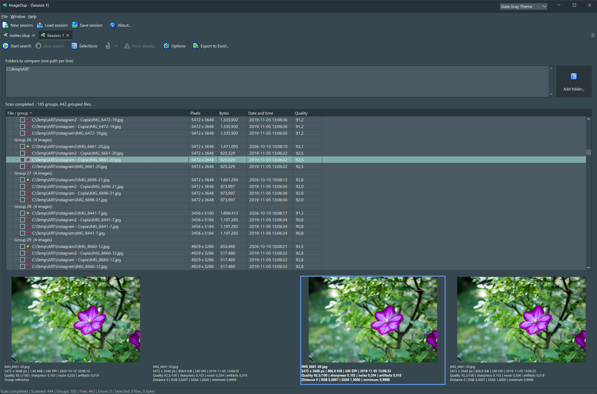

# ImageDup

   
  <em>The main window: similar-image groups, quality scores, and side-by-side previews.</em>

  
  
  
  

  

  
  
  

**Find, compare, rank, and manage visually similar images on Windows with Delphi 13 and VCL.**

ImageDup compares image content to find resized copies, recompressions, and sufficiently similar variants. It organizes results into groups, calculates a technical quality ranking to help choose a reference, and lets you select, export, move, or send files to the Recycle Bin.

The application uses an MDI interface: each child window holds an independent session with its own folders, options, results, and selections.

The Delphi project is in [`Source/`](Source/); translations, icons, and artwork are kept separately. The formulas and thresholds below describe the current source, not benchmark results or planned features.

## Contents

1. [Features and usage](#features-and-usage)
2. [Formats and decoding](#formats-and-decoding)
3. [Similarity, identity, and quality](#similarity-identity-and-quality)
4. [Comparison pipeline](#comparison-pipeline)
5. [Pixel preparation](#pixel-preparation)
6. [DCT theory](#dct-theory)
7. [ImageDup's perceptual hash](#imagedups-perceptual-hash)
8. [RGB and structural verification](#rgb-and-structural-verification)
9. [Matching quality setting](#matching-quality-setting)
10. [Grouping](#grouping)
11. [Quality ranking](#quality-ranking)
12. [Selections and file operations](#selections-and-file-operations)
13. [IDUP sessions and export](#idup-sessions-and-export)
14. [Threads and performance](#threads-and-performance)
15. [Project structure and building](#project-structure-and-building)
16. [Limitations, diagnostics, and validation](#limitations-diagnostics-and-validation)
17. [Contributing](#contributing)
18. [License](#license)

## Features and usage

### Quick start

1. Open a new session from the main window.
2. Add one or more folders. The picker supports multiple selections; each path occupies one line.
3. Open **Options** and choose the scan settings.
4. Click **Start search**.
5. Inspect the groups in the tree and compare their previews.
6. Choose a reference image, apply a selection rule, and review the checkboxes.
7. Save the session, export it to Excel, or perform an operation on the selected files.

A search can start only when at least one folder is specified. Paths are checked when scanning starts. Commands are enabled according to the session state.

### Per-session options

| Option | Range / initial value | Effect |
|---|---|---|
| Matching quality index | 0–10; initially 8 | Controls the maximum distance between DCT hashes. Higher values are more restrictive. |
| Number of threads | 1–64; initially 3 | Number of workers decoding and analyzing images. |
| Include subfolders | Initially enabled | Searches subfolders. |
| Include groups without duplicates | Initially disabled | Also displays groups containing one file. |

Changed options take effect on the next scan; they do not automatically rebuild the results already shown.

### Results and previews

The tree displays groups and files, checkboxes, pixel dimensions, file size, modification date/time, and technical quality. Icons distinguish the reference, members classified as identical to it, and members classified as different.

- Members are initially ordered by descending quality.
- Clicking the **File / group** header alternates group ordering by member count.
- Other headers order files within each group.
- **Shift + mouse wheel** moves between groups.
- Previews are arranged and resized according to the member count and available area.
- The session status bar shows progress, counts, and the number and total size of checked files.
- The progress bar is meaningful during a scan; until enumeration determines the total, progress is not yet determinate.

### Enlarged viewing

Clicking a preview opens the viewer on the session's monitor:

- if the image fits on the screen, it appears at its native dimensions;
- if it is larger, it initially fits within the screen;
- another click switches to native dimensions, after which dragging reveals areas outside the screen;
- a magnifying-glass cursor indicates that native dimensions are available;
- right click, Esc, or a click outside the image closes the viewer;
- clicking the image at native dimensions closes it; dragging is not treated as a click.

Double-clicking a file row opens the same viewer. Clicking a preview while it is open closes the current viewer.

The context menu on a file row or preview can set that file as the reference, select it in File Explorer, apply folder-based selection rules, or open a new session with the image's folder already entered. Creating that session does not start a scan automatically.

## Formats and decoding

The extension filter is centralized in **IsSupportedImageFile** in [ImageDup.Core.pas](Source/ImageDup.Core.pas).

| Format | Extensions |
|---|---|
| JPEG | .jpg, .jpeg |
| PNG | .png |
| Windows Bitmap | .bmp |
| GIF | .gif |
| TIFF | .tif, .tiff |
| WebP | .webp |
| HEIC / HEIF | .heic, .heif |

Extension matching is case insensitive. An accepted extension does not guarantee that every internal variant of the format can be decoded.

Reading uses **Windows Imaging Component (WIC)**:

1. Create a WIC factory in the reading thread.
2. Open the decoder selected by Windows.
3. Read frame zero.
4. Convert it to BGRA with 8 bits per channel.
5. Analyze it or construct a preview bitmap.

Comparison and preview share **LoadImagePixels**. The enlarged viewer uses the image already loaded for the preview.

Microsoft supplies GIF and TIFF WIC decoders. WebP and HEIF may require installed Windows extensions; HEIC may also require HEVC components. Availability and supported variants depend on the computer and on the decoders available to the Win32 or Win64 process. See [Microsoft's WIC codec documentation](https://learn.microsoft.com/en-us/windows/win32/wic/native-wic-codecs).

**Animated and multipage files:** only frame zero is used. ImageDup does not compare every TIFF page, the entire GIF/WebP animation, or every image in a HEIF container. Files that differ in later frames can therefore compare as equal.

Unreadable files appear in the error details. A missing WIC decoder has a dedicated message; other read errors are recorded without necessarily ending the whole scan.

## Similarity, identity, and quality

| Concept | Question answered | Criterion |
|---|---|---|
| Perceptual similarity | Are the images sufficiently similar? | DCT hash, RGB error, and structure. |
| ImageDup identity | Do their reduced representations match? | Zero hash distance and nearly zero RGB error at 64×64. |
| Technical quality | Which version should be preferred within a group? | Weighted metrics and metadata. |

Names, dates, file sizes, and DPI do not determine whether two images are similar. Original pixel dimensions are used for resampling but need not match. ImageDup does not calculate a cryptographic file hash to establish byte-for-byte identity.

### Meaning of “identical”

Members are assigned to the same identity class when:

~~~text
Distance = 0 AND RGBError <= 1e-12
~~~

RGBError is measured on the 64×64 RGB representation composited over white. Because it is computed from differences between byte values, this tolerance is, in practice, equality of that reduced representation.

It does not guarantee equal file bytes, metadata, original-resolution pixels, transparency, later frames, or details lost during downsampling. **ExactClass** identifies a class within a group; it is not a global file checksum.

### Meaning of “quality”

A score of 90 does not mean “90% faithful to the original”: the original is unknown. The ranking is heuristic and partly relative to the members of the same group.

**Matching quality index** and **QualityScore** are separate: the former sets comparison selectivity; the latter orders files that have already been grouped.

## Comparison pipeline

~~~mermaid
flowchart TD
    A[File accepted by extension filter] --> B[WIC: frame zero in BGRA]
    B --> C[Composite alpha over white]
    C --> D[Area resampling to 64 x 64]
    D --> E[Detail RGB and grayscale]
    D --> F[Average 2 x 2: RGB 32 x 32]
    F --> G[Grayscale 32 x 32]
    G --> H[DCT: 8 x 8 low frequencies]
    H --> I[Exclude DC and threshold by median: 63 bits]
    I --> J[Hamming filter]
    J --> K[RGB RMSE filter at 32 x 32]
    F --> K
    K --> L[RGB RMSE and block SSIM at 64 x 64]
    E --> L
    L --> M[Check against every group member]
~~~

The main routines are:

- **LoadSignature:** decoding, signature construction, and technical metrics;
- **SignatureFromBGRA:** area resampling;
- **FinishSignature:** reduction to 32×32 and DCT hash;
- **CompareSignatures:** ordered pairwise filters;
- **StructuralMetrics:** RGB error and structural similarity;
- **TGroupBuilder.Add:** group assignment.

## Pixel preparation

### Transparency

Each channel is composited over white before contributing to the signature:

$$
c_{\mathrm{visible}}=
\left\lfloor\frac{c\alpha+255(255-\alpha)+127}{255}\right\rfloor
$$

The channel and alpha range from 0 to 255. The 127 term rounds the integer division.

A fully transparent pixel becomes white regardless of its hidden RGB value. Transparency information is therefore lost from the signature. WIC previews are also composited over white.

### Area resampling to 64×64

The full image is mapped to a square grid of 64×64 samples. Each sample is the weighted average of source pixels intersecting its area.

For a destination rectangle projected into source coordinates as [L,R]×[T,B], the weight of an intersecting source pixel (x,y) is:

$$
w_{x,y}=
[\min(R,x+1)-\max(L,x)]
[\min(B,y+1)-\max(T,y)]
$$

considering only positive intersections. The resulting value is:

$$
p_{\mathrm{dest}}=
\frac{\sum_{x,y}w_{x,y}p_{x,y}}{(R-L)(B-T)}
$$

It is rounded and clamped to [0,255].

Source pixels contribute according to their covered area. This reduces aliasing compared with choosing just one pixel per sample, but cannot preserve every detail: tiny text, symbols, and watermarks may disappear.

**Aspect ratio:** normalization scales width and height independently. It does not letterbox to preserve proportions or apply an aspect-ratio prefilter. Previews, by contrast, retain the proportions when displayed.

### Reduction to 32×32 and grayscale

The 32×32 matrix averages each 2×2 block in the 64×64 RGB matrix:

~~~text
RGB32 = (sum of four RGB64 values + 2) div 4
~~~

DCT luminance is approximately:

$$
g=0.299R+0.587G+0.114B.
$$

The DCT uses floating-point values. The separate 64×64 grayscale matrix used for SSIM is rounded to bytes.

The code does not explicitly linearize the sRGB transfer curve or transform ICC profiles to a common color space.

## DCT theory

### From pixels to spatial frequencies

A grayscale image is a matrix of intensities. The discrete cosine transform (DCT) represents it as a weighted sum of cosine patterns:

- a constant pattern represents the average level;
- slowly changing patterns describe broad variations, such as a bright area beside a dark one;
- rapidly changing patterns describe fine alternations, edges, and texture.

A spatial frequency describes how quickly a signal changes across the image, not over time.

In photographs, much of the information about broad structure tends to be concentrated in low spatial frequencies. Resizing and moderate recompression can change fine details while leaving that structure relatively similar. This motivates a DCT-based perceptual hash, but does not guarantee a nearby hash for every transformation.

### One-dimensional DCT-II

One orthonormal convention for the DCT-II is:

$$
C_k=\alpha_k\sum_{n=0}^{N-1}x_n
\cos\left[\frac{\pi(2n+1)k}{2N}\right]
$$

where:

$$
\alpha_0=\sqrt{\frac1N},
\qquad
\alpha_k=\sqrt{\frac2N}\quad(k>0).
$$

Here n identifies a sample and k identifies a frequency. The 2n+1 term places samples half a step from the boundaries.

Several normalization conventions exist. The [SciPy DCT documentation](https://docs.scipy.org/doc/scipy/reference/generated/scipy.fft.dct.html) describes DCT-II and normalized versus unnormalized forms. ImageDup computes the cosine terms directly in Delphi; it does not depend on SciPy.

### Orthogonality, inverse, and energy

Define the basis function:

$$
\phi_k(n)=\alpha_k\cos\left[\frac{\pi(2n+1)k}{2N}\right].
$$

These functions obey:

$$
\sum_{n=0}^{N-1}\phi_k(n)\phi_j(n)=
\begin{cases}
1, & k=j, \\
0, & k\ne j.
\end{cases}
$$

The transform projects the signal onto independent directions. If all coefficients are retained, the signal can be reconstructed:

$$
x_n=\sum_{k=0}^{N-1}C_k\phi_k(n).
$$

With orthonormal scaling, squared energy is preserved:

$$
\sum_n x_n^2=\sum_k C_k^2.
$$

A complete DCT changes the representation of the information; it does not inherently discard it. ImageDup loses information through image downsampling, dropping frequencies, and quantizing each retained coefficient to one bit.

DCT-II can be understood in terms of an even extension of the signal at its boundaries. This explains why it uses only cosine terms, unlike a general DFT with complex components. ImageDup does not explicitly construct such an extension.

### Two-dimensional DCT-II

For a square matrix g(y,x) of side N:

$$
C(v,u)=\alpha_v\alpha_u
\sum_{y=0}^{N-1}\sum_{x=0}^{N-1}g(y,x)
\cos\left[\frac{\pi(2x+1)u}{2N}\right]
\cos\left[\frac{\pi(2y+1)v}{2N}\right].
$$

- u measures changes along the horizontal axis;
- v measures changes along the vertical axis;
- v=0 yields a pattern changing only along x;
- u=0 yields a pattern changing only along y;
- two nonzero indices describe two-dimensional patterns.

The C(0,0) coefficient, called **DC**, is proportional to the mean. The others are **AC** coefficients.

For N=32 and a constant image of intensity a, the orthonormal DCT has C(0,0)=32a and zero AC coefficients, apart from numerical rounding.

### Separability

The double sum can be evaluated in two stages:

$$
H(y,u)=\sum_x g(y,x)\cos\left[\frac{\pi(2x+1)u}{2N}\right]
$$

$$
C(v,u)=\alpha_v\alpha_u\sum_y H(y,u)
\cos\left[\frac{\pi(2y+1)v}{2N}\right].
$$

**FinishSignature** uses this property:

1. A horizontal pass over the 32 rows, for u from 0 through 7.
2. A vertical pass for v from 0 through 7.
3. Exclusion of the (0,0) coefficient.

Cosines are precomputed in **GCosines**:

~~~text
GCosines[u,x] = cos((2*x + 1)*u*pi/64)
~~~

The two passes accumulate approximately:

~~~text
32 * 8 * 32 + 63 * 32 = 10,208 terms
~~~

Computing the 63 coefficients independently would require 63×32×32 = 64,512 terms. The factor of roughly 6.3 concerns these arithmetic terms, not a measured speedup of the full application.

This is a separable DCT using direct sums and only the needed frequencies. It is not an FFT or an entirely assembly-language DCT.

### The normalization actually used

The code divides by √2 when u=0 and by √2 when v=0. It does not apply the global factor 2/N = 1/16. Before small numerical residuals are rounded to zero:

$$
C_{\mathrm{ImageDup}}(v,u)=16C_{\mathrm{orthonormal}}(v,u).
$$

The same positive multiplier on every coefficient does not change their comparison with the median. The relative 1/√2 factors where an index is zero do matter.

Coefficients with absolute magnitude below 10⁻⁷ are set to zero. That absolute threshold applies to ImageDup's coefficient scale.

### Why this is not JPEG's DCT

JPEG commonly uses a DCT too, but ImageDup performs a different calculation: it computes the transform of a global 32×32 representation of the decoded image, then retains an 8×8 selection of low frequencies excluding DC.

It does not read JPEG's compressed DCT coefficients or use JPEG quantization tables, and it also works on non-JPEG images.

The 8×8 region used for the hash identifies **selected frequencies**. The 8×8 blocks used later for SSIM are **spatial regions** of the 64×64 image. The two uses of “8×8” should not be confused.

## ImageDup's perceptual hash

### Frequency selection and median

The retained coefficients satisfy 0≤u≤7 and 0≤v≤7, except (0,0): **63 coefficients**.

Their order follows the code's loops, with v outside and u inside. It is neither JPEG's zigzag order nor a radial frequency selection.

Discarding DC reduces the hash's sensitivity to average brightness. The entire comparison is not brightness invariant: the RGB and SSIM checks still use brightness.

The 63 coefficients are copied, sorted, and compared with the middle element, index 31:

$$
m=\mathrm{median}(c_0,\ldots,c_{62}),\qquad
b_i=
\begin{cases}
1, & c_i>m, \\
0, & c_i\le m.
\end{cases}
$$

$$
h=\sum_{i=0}^{62}b_i2^i.
$$

The signature is stored in a UInt64; bit 63 remains unused.

The median limits the effect of a few extreme coefficients. The signature records which coefficients exceed the median, not their exact magnitudes.

With all coefficients distinct, exactly 31 bits are one. Ties at the median can produce fewer. These are not 63 independent, uniformly random bits.

### Hamming distance

$$
d_H(h_A,h_B)=\mathrm{popcount}(h_A\oplus h_B).
$$

An illustrative eight-bit example:

~~~text
A       10110010
B       10100011
A XOR B 00010001
distance = 2
~~~

**MaxHashDistance=63** is the nominal limit used in the setting. Each hash actually produced has at most 31 one-bits, so the greatest reachable distance between two such hashes is 62. If both have exactly 31 one-bits, the distance is even; median ties can also produce odd distances.

This does not alter the practical meaning of Matching quality 0: the hash filter becomes nonrestrictive.

### Robustness and collisions

The conceptual reference is the family of DCT perceptual hashes described by [pHash](https://phash.org/docs/design.html). ImageDup has its own implementation and does not use the pHash library.

Consequences of the code include:

- moderate recompression can leave coefficient ordering unchanged;
- a coefficient near the median can flip a bit after a small change;
- large color differences can be understated by a grayscale hash;
- uniform black and white images can both have zero AC coefficients and the same hash;
- a detail discarded during downsampling cannot affect the signature.

Removing DC makes AC coefficients ideally insensitive to adding a constant brightness offset. Multiplying every intensity by the same positive factor ideally preserves the ordering around the median. Clipping, rounding, color conversion, and numerical thresholds can break those properties in real images.

**A hash distance of zero or one does not prove duplication.** ImageDup continues with RGB and structural checks.

## RGB and structural verification

### First RGB filter: 32×32

After Hamming distance, **PixelError** computes normalized RGB root-mean-square error (RMSE):

$$
E_{32}=\frac1{255}
\sqrt{\frac1{32\cdot32\cdot3}\sum_{i,c}(A_{i,c}-B_{i,c})^2}.
$$

The result lies in [0,1]. It compares decoded channel values rather than a perceptually uniform color space such as Lab.

The default threshold of 0.08 corresponds to an RMSE of 20.4 levels on a 0–255 scale. This is a quadratic average, not a maximum error allowed for each channel.

### SSIM over 64 blocks

**StructuralMetrics** divides the 64×64 representation into 64 disjoint 8×8 blocks. For each, it computes luminance means, sample variances, and covariance: 64 samples, with denominator 63 for variances and covariance.

$$
S=
\frac{(2\mu_A\mu_B+C_1)(2\sigma_{AB}+C_2)}
{(\mu_A^2+\mu_B^2+C_1)(\sigma_A^2+\sigma_B^2+C_2)}
$$

$$
C_1=(0.01\cdot255)^2=6.5025,\qquad
C_2=(0.03\cdot255)^2=58.5225.
$$

The SSIM formula compares luminance, contrast, and structure. See the [original authors' SSIM material](https://www.cns.nyu.edu/~lcv/ssim/).

ImageDup uses uniform weights, nonoverlapping blocks, and one scale. **It is not the reference implementation with a sliding Gaussian window, nor MS-SSIM.** Its thresholds cannot simply be transferred to another SSIM library.

Each block score is clamped to [−1,1]. The routine yields:

- **Structural:** the mean of the 64 scores;
- **WorstStructural:** the lowest block score;
- **WorstRGB:** the highest normalized block RGB RMSE;
- **RGBError:** RGB RMSE over the full 64×64 matrix.

### Complete acceptance rule

A pair is accepted only when **all** checks pass:

| Check | Condition |
|---|---|
| DCT hash | Distance ≤ threshold from Matching quality |
| 32×32 RGB | RMSE ≤ 0.08 |
| 64×64 RGB | RMSE ≤ 0.08 |
| Mean block SSIM | ≥ 0.97 |
| Worst block SSIM | ≥ 0.80 |
| Worst block RGB | RMSE ≤ 0.18 |

The constants are in [ImageDup.Core.pas](Source/ImageDup.Core.pas). MaxRGBError is an API parameter; the GUI scan passes **DefaultMaxRGBError=0.08**.

Checking the worst block prevents a localized difference from being hidden by a good global mean. It cannot recover a detail that vanished during downsampling.

Cheap filters run first. A pair rejected by Hamming distance or 32×32 RGB is not passed to the structural calculation.

## Matching quality setting

For integer q from 0 to 10:

~~~text
d = ((10 - q) * 63 + 5) div 10
~~~

| q | Maximum distance |
|---:|---:|
| 0 | 63 |
| 1 | 57 |
| 2 | 50 |
| 3 | 44 |
| 4 | 38 |
| 5 | 32 |
| 6 | 25 |
| 7 | 19 |
| 8 | 13 |
| 9 | 6 |
| 10 | 0 |

The initial value 8 therefore means 13 bits, not 8.

This option changes **only the Hamming filter**, not the RGB or SSIM thresholds. Many pairs can still fail at q=0; at q=10, they need identical hashes but not identical original bytes or pixels.

There is no calibrated “similarity percentage.” A quantity such as 1−d/63 would be a simple normalization, not the probability that the files are duplicates.

## Grouping

The coordinator compares each new signature with every signature already processed and records accepted pairs. **TGroupBuilder.Add** then tries existing groups in creation order.

An image joins the first group whose **every member** is similar to it, not just the group's reference image. If no group qualifies, a new one is created.

This is a greedy, first-fit procedure with complete checking within each group. It is not complete hierarchical clustering, and it does not merge groups that were created earlier.

### Why transitivity is insufficient

~~~text
A is similar to B
B is similar to C
A is not similar to C
~~~

Connected-component grouping would put A, B, and C together. ImageDup does not: if A and B already share a group, C must pass comparison with both.

Thresholded similarity is not transitive. Checking all members limits similarity chains.

### Input order and reference

The partition depends on file enumeration order because assignment is greedy. Workers run in parallel, but the coordinator consumes their results in the original order. Given the same files, decoders, and enumeration order, changing the thread count does not change insertion order. The application does not globally sort filesystem enumeration.

Singleton groups are always retained internally. **Include groups without duplicates** controls whether they also appear in the tree. A second member updates the group with the same ID.

**CalculateGroupQuality** orders members by descending quality and selects the first as the reference if none was chosen explicitly. On recalculation, an explicit reference remains in place while that file remains present.

Changing the reference updates displayed relationships and reference-based selections; it does not rerun clustering.

## Quality ranking

**CalculateGroupQuality** in [ImageDup.Groups.pas](Source/ImageDup.Groups.pas) calculates the ranking. **AnalyzePixels** in [ImageDup.Core.pas](Source/ImageDup.Core.pas) produces most of the underlying pixel metrics.

### Actual weights

The original ten criteria total 100 points; their sum is multiplied by 0.85. Color mode contributes the remaining 15 points.

| Criterion | Original weight | Maximum effective weight |
|---|---:|---:|
| Resolution | 24 | 20.40% |
| Sharpness | 24 | 20.40% |
| Absence of block artifacts | 14 | 11.90% |
| Low noise | 10 | 8.50% |
| Color depth | 7 | 5.95% |
| Color profile present | 3 | 2.55% |
| Absence of clipping | 7 | 5.95% |
| Absence of banding | 5 | 4.25% |
| Low upscaling risk | 4 | 3.40% |
| Chroma subsampling | 2 | 1.70% |
| Color mode | Separate | 15.00% |
| **Total** | | **100.00%** |

These weights are in the code and cannot currently be changed in the Options dialog.

### Formula

$$
Q=\mathrm{clamp}(0.85Q_{\mathrm{base}}+15f_{\mathrm{color}},0,100)
$$

$$
\begin{aligned}
Q_{\mathrm{base}}={}&24f_{\mathrm{res}}+24f_{\mathrm{sharp}}+
14(1-a)+10(1-n)+7f_{\mathrm{depth}}\\
&+3f_{\mathrm{ICC}}+7(1-c)+5(1-b)+4(1-u)+2f_{\mathrm{chroma}}.
\end{aligned}
$$

Here a, n, c, b, and u mean artifacts, noise, clipping, banding, and upscaling risk. Higher values impose larger penalties.

The group-relative factors are:

$$
f_{\mathrm{res}}=\sqrt{\frac{WH}{\max_{\mathrm{group}}(WH)}},
\qquad
f_{\mathrm{sharp}}=
\frac{\mathrm{Sharpness}}{\max_{\mathrm{group}}(\mathrm{Sharpness})}.
$$

If the maximum pixel count is not positive, the resolution factor is zero. If maximum sharpness does not exceed 10⁻¹², its factor is set to 0.5.

Adding or removing a member can change the other members' scores. Scores in different groups are not an absolute common scale; even a singleton does not automatically receive 100.

### Sampling

AnalyzePixels uses this step size:

$$
s=\max\left(1,\left\lceil\sqrt{\frac{WH}{500000}}\right\rceil\right).
$$

This is an approximate bound on sample count, not a resize to fixed dimensions. It excludes borders needed to inspect neighboring samples.

Its luminance calculation is an integer approximation using R=77, G=150, B=29, divided overall by 256. It is not numerically identical to the DCT's floating-point luminance formula.

### Implemented metrics

| Metric | Calculation | Interpretation limit |
|---|---|---|
| Sharpness | RMS of a four-neighbor Laplacian, divided by 255 | Not exactly Laplacian variance: it does not subtract the Laplacian mean. Texture and noise can increase it. |
| Noise | Mean absolute Laplacian where the gradient is ≤18, divided by 32 | Grain, texture, and actual detail are not perfectly separated. |
| Artifacts | Difference between average jumps at x divisible by 8 and other jumps, divided by 24 | Heuristic for vertical discontinuities; does not measure every compression artifact or ringing. |
| Clipping | Fraction of luminance samples ≤2 or ≥253 | Also counts intentional black and white, including text and backgrounds. |
| Banding | Fraction of small transitions multiplied by scarcity of occupied levels | Does not recover the source's true tonal precision. |
| Upscaling | clamp((fraction of nearly repeated horizontal pixels −0.10)/0.60, 0,1) | Measures repetition; does not prove artificial enlargement. |
| Color mode | max(R,G,B)−min(R,G,B)>8 in at least 1% of samples | Heuristic dependent on content and sampling. |

More precisely:

- Laplacian: 4C−L−R−U−D, with neighbors s pixels away.
- Gradient: max of the absolute R−L and D−U differences.
- Banding: positive transitions between C and L are “small” at ≤2; the level-scarcity factor is 1−min(1, occupiedLevels/160).
- Upscaling: the compared horizontal neighbor is instead **one pixel** away; a difference ≤1 counts as nearly repeated.
- Artifact detection uses x mod 8. If the sampling step aligns all samples with block boundaries, there may be no interior samples and the metric stays at zero.

Defect metrics are clamped to [0,1]. Images too small to provide interior samples leave several metrics at their initial values, reducing ranking reliability.

### Color mode: 15%

If at least 1% of sampled pixels cross the chromatic threshold, the image is classified as color. Otherwise, no more than two occupied luminance levels mean monochrome; the remaining case is grayscale.

| Mode | Factor | Points |
|---|---:|---:|
| Color | 1 | 15 |
| Grayscale | 0.5 | 7.5 |
| Monochrome | 0 | 0 |
| Unknown | 0.5 | 7.5 |

This is an application preference, not a claim that artistic black-and-white photography is intrinsically worse.

### Color metadata

Bit depth is estimated from WIC as bits per pixel divided by channel count, rounded up. This describes what the decoder exposes; indexed formats and unusual channel layouts require caution.

| Estimated depth | Factor |
|---|---:|
| Unknown or ≤0 | 0.70 |
| Up to 8 bits | 0.75 |
| Up to 10 bits | 0.88 |
| Up to 12 bits | 0.94 |
| Above 12 bits | 1.00 |

At least one WIC color context gives ICC factor 1; absence gives 0.8. The code does not measure gamut width or rank sRGB, Adobe RGB, Display P3, and ProPhoto.

Pixel analysis still takes place **after conversion to 8 bits per channel**. Ranking uses source bit-depth metadata but does not analyze every original gradation of a 16-bit image.

For JPEG, the parser reads sampling factors from SOF markers and treats the first component as luminance:

| Subsampling | Factor |
|---|---:|
| 4:4:4 | 1.00 |
| 4:2:2 | 0.80 |
| 4:2:0 | 0.60 |
| Grayscale or not applicable | 0.90 |
| Other | 0.70 |
| Unknown | 0.75 |

The application does not estimate the “JPEG quality” setting of the program that saved the file.

DPI, file size, and modification date do not enter the quality score. They are display information or explicit ways to choose a reference. The same pixels tagged as 72 DPI or 300 DPI have the same digital detail.

## Selections and file operations

### Reference choice

Within each group, the reference can be chosen by highest/lowest quality, highest/lowest resolution (width×height), largest/smallest file size, or newest/oldest modification time.

The context menu also allows the current file to be set directly as reference.

### Selection rules

The main automatic rules select, across all groups:

- every member except the reference;
- members identical to the reference;
- members different from the reference.

These replace earlier selections and exclude the reference.

Folder-based context actions select files **in other groups** from the same directory or from different directories. They compare normalized exact directories rather than recursively testing descendants. They also clear earlier selections and may select references in other groups.

**Keep at least one file unselected in each group** operates on current checkboxes: if every member is checked, it unchecks the reference. **Clear all selections** clears every checkbox.

Checking a file does not itself move or delete it.

### Recycle Bin

**Move to Recycle Bin** requires confirmation and uses IFileOperation. A progress sink checks the recycling path and refuses permanent deletion if the Recycle Bin is unavailable.

Files that fail to move are reported and remain in the results. The operation is not one transaction across all files: some may succeed while others fail.

### Moving to a folder

The **Move to a folder...** dropdown command preserves structure relative to the common root of search folders:

~~~text
Search folders: D:\Photos\2023 and D:\Photos\2024
Common root:    D:\Photos
Source file:    D:\Photos\2024\Trip\photo.jpg
Destination:    E:\Archive
Result:         E:\Archive\2024\Trip\photo.jpg
~~~

If no common root exists, each file's volume root is used, with a directory derived from the volume/server to keep origins separate.

Directories are created as needed. An existing destination file is reported as an error and is not automatically overwritten. Moved paths are updated in the session.

## IDUP sessions and export

### The .idup document

An IDUP file is **UTF-8 JSON** with format identifier ImageDupSession and version 1. It does not archive image data.

An illustrative empty session:

~~~json
{
  "format": "ImageDupSession",
  "version": 1,
  "scannedFiles": 0,
  "criteria": {
    "paths": ["D:\\Photos"],
    "recursive": true,
    "includeSingletons": false,
    "quality": 8,
    "pixelError": 0.08,
    "threadCount": 3
  },
  "selectedFiles": [],
  "groups": []
}
~~~

For each member, it stores path, dimensions, DPI, bytes, modification time, quality metrics, score, identity class, reference status, and comparison metrics.

**scannedFiles** restores the processed-file count. It may include files whose decoding was attempted but failed; it is not merely the number of members in displayed groups.

Compatibility behavior:

- Missing includeSingletons means false.
- Missing threadCount means 3.
- If quality is missing, an older distance value is converted.
- Several later metadata fields have default values.
- qualityScore is saved, but group ranking is recalculated on load.

pixelError remains in the file format for compatibility; a new GUI scan uses the core's default threshold.

Pixels, previews, and full DCT signatures are not saved. Images remain external. Moving or deleting them outside the application can make previews unavailable and leave stored information out of date. Loading a session does not fully revalidate every file. Local paths are stored in plain text.

### Documents and closing

The Main window manages New, Load, Save, Save as, About, and child-window layout. The first child window is maximized.

Changes to a session trigger a save prompt when it closes. Closing the Main window coordinates sessions, cancellation, and operations still in progress.

One or more documents can be provided at startup:

~~~text
ImageDup.exe "D:\Sessions\Archive.idup" "D:\Sessions\Trips.idup"
~~~

This opens the GUI and the specified documents. There is no headless scan CLI.

### Excel

Export creates an **.xlsx** file using Open XML and ZIP. Generating it does not require Microsoft Excel or use Excel COM automation.

| Column | Meaning |
|---|---|
| Group | Group |
| File | Full path |
| Filename | File name |
| File path | Directory |
| Pixels | Width and height |
| Bytes | File size |
| Date and time | Modification time |
| Quality | Technical score |
| Selected | Checkbox state |
| Relationship | Reference, identical, or different from reference |

Export includes session results, not just checked files. It does not embed images or replace the .idup document.

## Threads and performance

### What runs in parallel

Each scan creates a **TImageScan** coordinator, the configured number of **TSignatureWorker** threads, and a queue synchronized with TMonitor.

Workers read and decode files, construct signatures, and analyze technical quality. The coordinator consumes results in original order, compares signatures, and updates groups.

**Pairwise comparisons and insertion into groups remain serial in the coordinator.** More threads mainly speed up per-file work; they do not remove the growing comparison cost.

The queue limits how far workers can run ahead to max(2, 2×threadCount). This bounds completed results waiting behind a slow file, but not the signatures already retained for later comparisons.

The GUI collects updates via **Drain** using a timer initially set to 200 ms. Workers do not manipulate VCL controls. Cancellation is cooperative: it does not forcibly interrupt a decoder call already underway.

Each session can have its own scan; concurrent sessions multiply worker and memory requirements.

### Complexity

For n successfully decoded images, the potential pair count is:

$$
\frac{n(n-1)}2.
$$

| Images | Potential pairs |
|---:|---:|
| 1,000 | 499,500 |
| 10,000 | 49,995,000 |
| 100,000 | 4,999,950,000 |

Hamming distance is evaluated for considered pairs; later filters run only on pairs that pass earlier checks.

The project currently has no BK-tree, locality-sensitive hash index, approximate-nearest-neighbor search, or GPU comparison. Execution time is not guaranteed to scale well to millions of images.

### Memory

The main signature arrays occupy:

~~~text
DetailRGB  64 * 64 * 3 = 12,288 bytes
DetailGray 64 * 64     =  4,096 bytes
RGB        32 * 32 * 3 =  3,072 bytes
Hash                  =      8 bytes
Base total            = 19,464 bytes
~~~

Metrics, records, strings, lists, and dictionaries add overhead. For 100,000 signatures, this base total alone exceeds 1.8 GiB.

Each worker may also hold a BGRA buffer of 4×width×height bytes, besides decoder allocations. A 24-megapixel image needs about 96 MB for that buffer alone. Previews add full-resolution bitmaps.

The core refuses decoded buffers larger than MaxInt bytes, but memory can run out much sooner. Win64 is preferable for large collections. Choose thread count with available RAM in mind.

### Existing optimizations

- Precomputed cosine table.
- Separable DCT limited to needed frequencies.
- Filters ordered by cost.
- Sampled technical-quality analysis.
- Assembly POPCNT on Win64 when supported by the CPU.
- Portable bit-count fallback that clears the lowest set bit on each iteration.
- Signatures retained in memory for subsequent comparisons.

The DCT and RGB loops are not wholly implemented in assembly language.

## Project structure and building

### Repository layout

| Path | Contents |
|---|---|
| [`Source/`](Source/) | Delphi project, Pascal units, DFM forms, and embedded resources. |
| [`Translations/ImageDup.xlat`](Translations/ImageDup.xlat) | Translation project. |
| [`Assets/icons-v5-soft-blue/`](Assets/icons-v5-soft-blue/) | Application and action icons, including high-resolution PNG sources. |
| [`Assets/cursors/`](Assets/cursors/) | Custom zoom cursor asset. |
| [`Art/main.png`](Art/main.png) | Application screenshot used above. |
| `Bin/` | Local binary/output directory; not required to read the source. |
| [`LICENSE`](LICENSE) | Mozilla Public License 2.0. |

### Modules

| File | Responsibility |
|---|---|
| [ImageDup.dpr](Source/ImageDup.dpr) | Startup, resources, style, and creation of forms/data module. |
| [ImageDup.FormMain.pas](Source/ImageDup.FormMain.pas) | MDI container, documents, coordinated closing. |
| [ImageDup.FormSession.pas](Source/ImageDup.FormSession.pas) | Tree, selections, previews, commands, and session state. |
| [ImageDup.Options.pas](Source/ImageDup.Options.pas) | Scan options dialog. |
| [ImageDup.Scan.pas](Source/ImageDup.Scan.pas) | Enumeration, workers, and coordinator. |
| [ImageDup.Core.pas](Source/ImageDup.Core.pas) | WIC, signatures, DCT, RGB, SSIM, and pixel metrics. |
| [ImageDup.Groups.pas](Source/ImageDup.Groups.pas) | Grouping, identity, ranking, and reference. |
| [ImageDup.Session.pas](Source/ImageDup.Session.pas) | JSON session serialization. |
| [ImageDup.ExcelExport.pas](Source/ImageDup.ExcelExport.pas) | XLSX generation. |
| [ImageDup.Recycle.pas](Source/ImageDup.Recycle.pas) | Recycle Bin operations. |
| [ImageDup.FileMove.pas](Source/ImageDup.FileMove.pas) | Structure-preserving moves. |
| [ImageDup.FormAbout.pas](Source/ImageDup.FormAbout.pas) | About dialog. |
| [ImageDup.Resource.pas](Source/ImageDup.Resource.pas) | Shared ImageCollection and VirtualImageLists. |

Forms and the data module have accompanying DFM files. Actions connect visual controls and menus to application logic.

### Development requirements

- Windows and Delphi 13 with VCL.
- Virtual Treeview units/packages installed for the selected platform and visible to the Delphi IDE.
- WIC decoders for the image formats you intend to scan; WebP and HEIC/HEIF support depends on installed Windows codecs.

Clone the repository and open [`Source/ImageDup.dproj`](Source/ImageDup.dproj) in Delphi. Select **Win32** or **Win64** and build the project in the IDE. The project file and its Pascal/DFM/resources are in `Source/`; icon paths point to `../Assets/`. For Win64, the executable and compiler output are configured in `Bin/` at the repository root; Win32 still uses `Source/Win32/`. Existing binaries are local artifacts and may not match the current source. No prebuilt executable is required to browse the repository.

Platform entries generated in the project file do not make this VCL application compatible with Android, macOS, or Linux.

### Resources and styles

The DPR needs both directives:

~~~pascal
{$R *.res}
{$R *.dres}
~~~

[`Source/ImageDup.res`](Source/ImageDup.res) contains the application resources. Delphi also generates a `.dres` file for the VCL styles listed in the project options. The bundled style names are Windows10, Windows10 Blue, Windows10 Dark, Windows10 Green, Windows10 Purple, and Windows10 SlateGray; the combo box displays shorter translated captions.

Startup selects Windows10, then restores the last chosen style from the current user's `Software\ImageDup` registry key. If the saved style is unavailable, startup falls back to the default. The internal style name must match a style actually embedded or loaded. For “Style ... not found”, check `Custom_Styles` and both resource directives; a VSF file on disk alone is insufficient.

### Localization

The interface uses English text. Extracted code strings are `resourcestring` declarations with the **rs** prefix near their use; captions and hints also appear in DFM files. [`Translations/ImageDup.xlat`](Translations/ImageDup.xlat) contains the translation project. Complete localization must account for resourcestrings, DFM properties, and any remaining literal strings in source; the `.xlat` file is not a runtime dependency for the default English build.

## Limitations, diagnostics, and validation

### Comparison features not implemented

- Semantic recognition using neural networks.
- Geometric alignment or searches for rotations and mirror images.
- Robust matching of crops and perspective changes.
- Explicit EXIF Orientation normalization.
- Explicit ICC conversion to a shared color space.
- Comparison of every frame or page.
- Cryptographic or byte-for-byte verification.
- A reliable estimate of natively captured resolution.
- Specialized models that reliably distinguish fine detail, noise, ringing, and banding.

Results also depend on the pixels and metadata exposed by the installed decoder. The core adds no independent normalization for all those aspects.

### Diagnostics

| Symptom | Possible explanation |
|---|---|
| DCT distance zero but images differ | Hash collision; RGB and structure must also be examined. |
| No group even at Matching quality 0 | RGB and SSIM checks remain active. |
| Tiny watermark not detected | It can disappear during downsampling. |
| Rotated or cropped copy not detected | Geometric alignment is absent. |
| GIFs seem the same but animations differ | Only frame zero is read. |
| TIFFs appear identical but later pages differ | Only the first page is read. |
| WebP/HEIC cannot be read | Decoder missing, unsupported variant, damaged file, or another read error. |
| A larger image ranks lower | Resolution is only one criterion; defects can outweigh it. |
| Score changes after a member is removed | Resolution and sharpness are relative to the group. |
| More threads do not help | Serial comparisons, I/O, or memory may dominate. |
| Previews unavailable after opening an IDUP file | Stored paths may no longer exist. |

The auxiliary **SignatureFromGraphic** routine is not the WIC scan path. In the current source it still indexes vertically through VCL ScanLine in the opposite order. Verify and align it before mixing its signatures with those produced by LoadSignature. The **LoadImagePreview** path uses ScanLine[Y].

This README does not report measured precision or recall on a labeled dataset. Implemented thresholds are not a statistical guarantee against false positives.

### Validation strategy

A repeatable evaluation should separate:

1. **Numerical correctness:** compare the separable DCT with a reference DCT; check the factor of 16, excluded DC, median, and bit order.
2. **Application invariants:** one group per file; every internal pair compatible; same input order produces the same grouping under different thread counts.
3. **Decoding:** vertically asymmetric images to reveal flipping, alpha, animated GIF, multipage TIFF, WebP/HEIC with and without decoders.
4. **Detection quality:** labeled copies, recompressions, resizes, and genuinely different images.
5. **Ranking:** sharp, blurred, noisy, heavily compressed, and artificially enlarged variants.

Useful controlled examples include:

- Uniform image: ideally zero AC coefficients.
- Uniform black versus uniform white: possibly equal hashes but very different RGB.
- Hash distance zero: no implication of file identity.
- Fully transparent pixels: equivalent to white in the current model.
- A~B and B~C, but A not~C: no single group containing all three.
- One file with includeSingletons enabled: visible group and reference.
- Older session without includeSingletons: it loads as false.

This is a documented strategy, not a claim that all such tests are automated or were run while writing this README.

### Possible future improvements, not implemented

- Verify original bytes or full-resolution pixels before declaring exact identity.
- Explicit EXIF normalization and color management.
- Optional comparison of all frames or pages.
- Signature indexes to reduce pair counts.
- Controlled parallel pair comparison.
- Persistent cache invalidated when a source file changes.
- Quality metrics validated on datasets, with separate profiles for photos, documents, and graphics.
- Reduced-resolution preview decoding, with full decoding only for enlarged viewing.

### References

Implementation details in this README come from the project source. For theory and APIs:

- [SciPy: DCT definitions and normalization](https://docs.scipy.org/doc/scipy/reference/generated/scipy.fft.dct.html).
- [pHash: perceptual-hash design](https://phash.org/docs/design.html).
- [Wang, Bovik, Sheikh, Simoncelli: SSIM and the 2004 publication](https://www.cns.nyu.edu/~lcv/ssim/).
- [Microsoft: WIC codecs](https://learn.microsoft.com/en-us/windows/win32/wic/native-wic-codecs).
- [Microsoft: HEIF codec through WIC](https://learn.microsoft.com/en-us/windows/win32/wic/heif-codec).

SciPy and pHash are theoretical references, not ImageDup runtime dependencies.

## Contributing

Bug reports and pull requests are welcome. For comparison errors, include the image formats, scan options, expected and actual grouping, and a small reproducible set of images you have permission to share. For UI or build problems, include the Delphi version, Windows version, target platform, and exact error message. Please avoid posting private image collections or personal file paths in public issues.

Changes to the perceptual matching or ranking logic should explain the effect on false positives and false negatives. The validation strategy above lists useful regression cases.

## License

ImageDup is distributed under the [Mozilla Public License 2.0](LICENSE). See the license file for its terms.
